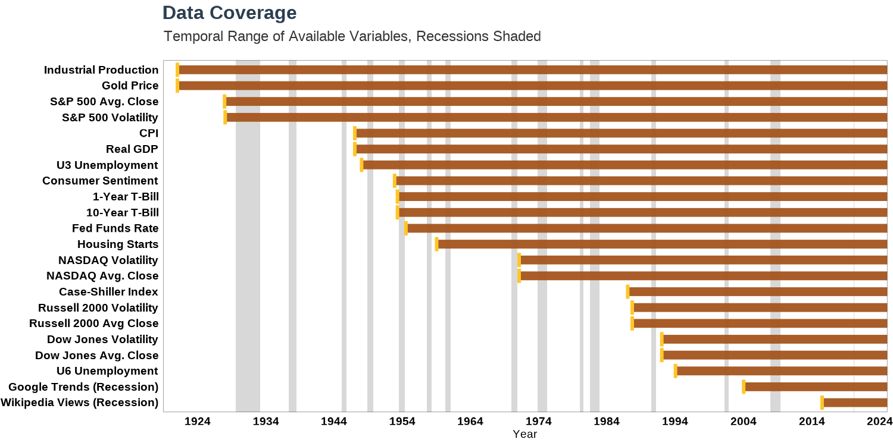
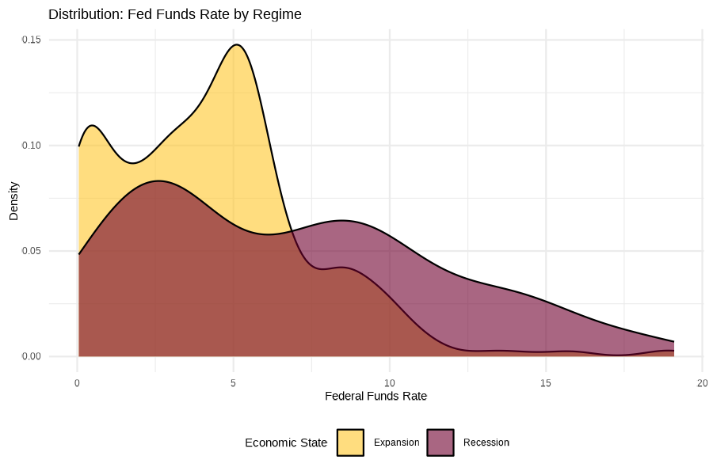
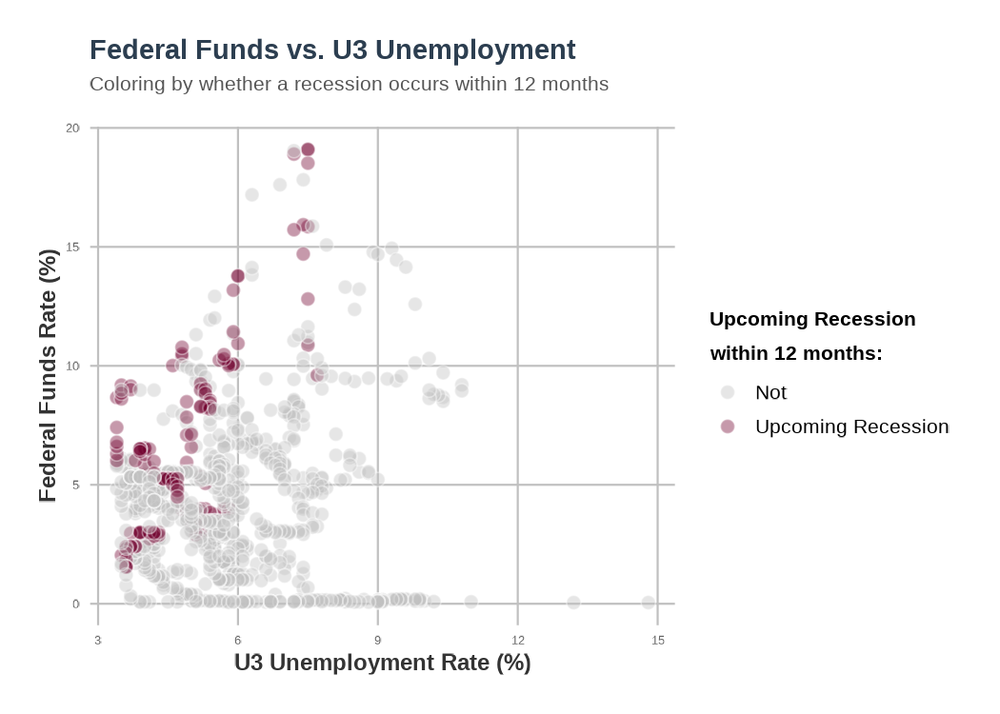
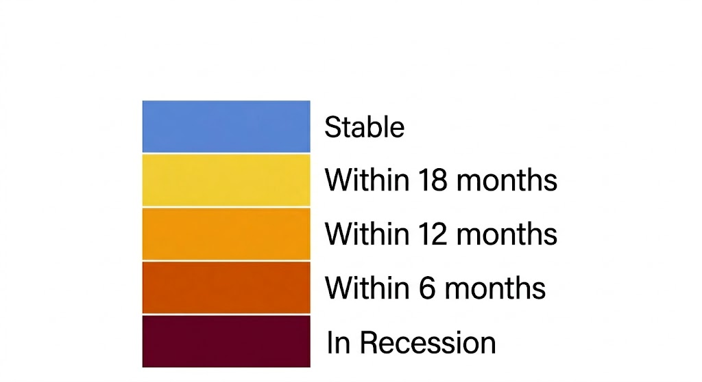

```{r setup, include=FALSE}
knitr::opts_chunk$set(
  echo = FALSE,      # Hide code
  error = FALSE,     # Hide error messages
  warning = FALSE,   # Hide warnings (like "NAs introduced")
  message = FALSE,   # Hide package loading messages
  fig.align = "center" # Centers all your plots automatically
)

```

## Topic and Motivation

For this project, we aim to predict recessions, with more accuracy than existing indicators. In particular, existing recession indicators tend to be far overfit, and create an indicator as a function of one or two macroeconomic variables which historically change in advance of recessions. These tend to have many false positives -- hence the saying "economists have predicted 11 of the past 5 recessions." We believe we can create an indicator which uses many more variables, and identify a region of space which contains recessions -- when our vector of these variables enters this region, the recession indicator will flag. Importantly, this will rely on all of the variables we use, rather than some small subset.

## Data and Processing

Our data is retrieved from Yahoo Finance (via the "tidyquant" R package) and from FRED (also via the "tidyquant" R package). This data includes time series for the daily close of major stock indices (S&P 500, DOW, NASDAQ, Russel 2000), common hedges for uncertainty (gold, silver, Case-Schiller Index for real estate), and monthly data on macroeconomic data (U3 and U6 unemployment, GDP, CPI, Federal Funds Rate, Housing Starts, ...) (A full data appendix is found in the [*clean_data.R*]{.underline} script). Additionally, API sourcing is used to collect two measures of consumer sentiment around recessions; google search trend data for "recession" and wikipedia page visits for "recession", to better obtain a sort of "panic" measure that may be useful in predicting recessions. Collectively, these present a multi-faceted image of the economy at a point in time -- in particular, they represent both classical macroeconomic indicators and aggregating signals for the "shadow economy" of asset prices and volatility hedges. Further, the vast majority of our data begins well before 2000, with some stretching back to the beginning of the 20th century, a visualization attached below will demonstrate that. Recession data is manually collected into a dataframe for easy joining with the larger dataset, the data is from the NBER. Lagged indicators for if a recession starts in the next 6, 12 and 18 months are created from this data and will serve as our target predicted variable in terms of forecasting recessions.

The vast majority of our data is observed monthly, therefore, we collapse our more granular data (like asset prices) to a monthly level, creating a monthly mean close price and an interday volatility measure from the variance of these daily closing prices within the month. This collapsed data is combined with the other data, merging on the **primary key of year-month**, at which point **a single primary key** for our cleaned dataset is created.

Additionally, linear imputation was performed on the consumer sentiment variable, which was observed quarterly until the late 1970's, following this though, it too is observed on a monthly basis.

It is also worth noting again that there is a "data appendix" in the "clean_data.R" script containing much more detailed descriptions of each variable and its source.

From this, we do some further processing, to create a relative-scaled first-difference dataset. Importantly, this relative-scaled first-difference is computed as a direct first-difference for those values which are already in percentage terms (interest rates or unemployment), and similarly, we also use this direct first-differencing for mean-reverting series, to avoid seeing explosive growth around zero or negligible percent changes for large level-valued changes as it reaches peaks or troughs. Both the transformed and the untransformed data can be useful, but the first difference and relative scaling normalizes and whitens the data, reducing issues of autocorrelation and scale differences between variables. These transformations are also then formally normalized, as that is what persistent homology requires to work properly.

Finally, we append some functions of our variables onto that dataset to allow for a more robust approach when using persistent homology. In particular, we use log-returns for our asset data and other compounding indices, which tend to exhibit exponential growth and would thus distort the spacial "shape" of the data we intend to exploit in such a manner as to dominate any further processes, despite its failure as a dominant indicator of recessions.

In terms of missing data, the only missingness of concern is the lack of duration that some features have data for. Aside from that, missing values are of little concern at this stage, keeping in mind our temporal restrictions. For a better demonstration of the ranges of our variables of interest, observe the following chart.

```{r, echo=FALSE, out.width="110%", fig.align="center", fig.cap="All of the plots are included in the MacroVars_EDA.R script"}

```

To ensure the robustness and validity of the data, an analysis of outliers is also carried out on the data, using the *dlookr* package in R. Using this tool, we discovered that while there are extreme values, they are naturally occurring, as most can be explained by looking at the historical period in which they lay. This analysis also shed light to the variability of some of our variables, with certain ones being composed of \~35% outlier observations. With all that said, we will keep these extreme values, as not only are they "real observations", but also are vital for the shocks that we are looking for in our Persistent homology approach.

These steps were carried out in the direction of the "**data cleaning checklist**", which is applied completely in the "clean_data.R" script, though due to the formalized and clean nature of the data we bring in, the data is quite "clean" already.

### Analysis of Macroeconomic Data

Prior to processing our data into topological structures, to predict recessions it is important to know if we have ground to stand on in the first place. In that, we need to determine if these variables, and their relationships meaningfully differ when the economy is in a recession, or near one.

We do so by choosing two representative variables, that are often named as some of the most important macroeconomic indicators; the federal funds rate and the u3 unemployment rate. We restrict our exploratory data analysis to just these variables since doing every subset of the variables in our dataset would be impractical, and it is not unrealistic to think that the lessons learned from just these variables can be applied to many of the others in our data set owing to the theoretical interconnecitvity of all of our variables.

With each of these two variables, conditional distributions are created, where we look to see if the distribution of either variable is notably different depending on if the month of observation was recessionary or not. For both variables, whether looking at levels or measures of monthly change, the distributions are different in respect to their month's recessionary status, for example,

```{r, echo=FALSE, out.width="70%", fig.align="center", fig.cap="All of the plots are included in the MacroVars_EDA.R script"}

```

These findings give us foundational reasoning to suspect that there are different, detectable regimes with these variables depending on if the economy is in a recession or not, giving credence to the idea that recessionary periods have different topological structures than stable periods do. This implyies that our Wasserstein metric prediction method may have some weight behind it. But again, this is very cursory evidence, and shouldn't be seen as definitive in any sort.

To gain more momentum behind our topological approach, it is also of use to see if the relationships between these two variables changes dependent on recessionary status, as this is ultimately what our topological approach hinges upon. We plot the two variables against eachother, both in levels and rates, to see if their relationship changes dependent on economic stability, and find visual evidence across both levels and rates that there is some change in the relationship, particularly when looking at if the period prior to a recession (as that is ultimately what we want to predict-if we're in a month with a recession upcoming). If there were no regime-effect, we'd see the red dots evenly distrbuted among the grey dots.

```{r, echo=FALSE, out.width="70%", fig.align="center", fig.cap="All of the plots are included in the MacroVars_EDA.R script"}

```

We also examine how the two variables vary together through time by looking at a joint time series between the two against shaded recession periods. These plots show a slight relationship, and but certainly nothing that is visibly noteworthy. These plots are interactive and are found in the MacroVars_EDA.R script. They are not included here to reduce cluttering, keeping in mind the rubric.

We also conduct an analysis of extreme values for these two variables and find notable outliers for both, but since both are true, factual data, which can be explained by events at the time, they are retained. Their retention is also necessary when considering our topological approach, as the Wasserstein distances will be driven by large shocks that an outlier causes. This extreme value analysis was then expanded to every variable, and as touched on in the first section of this report, no outliers will be excluded from analysis, as they are all "real" datum, and drive our Wasserstein TDA approach.

### Analysis of Topological Data

As is outlined in the introduction, our analysis will be examining the "distance" between topological structures from one time window to the next using Wasserstein distances (which are calculated for each dimension of topological structure in a given window). These distances will be the variables that will be used to predict if a month is near an upcoming recession or not. A more thorough description of our process is found in the methodology section.

With that said, due to unequal data coverage, computational limitations, and lessons from other similar empirical approaches, we don't and cannot use our full data in our TDA approach (Gidea & Katz, 2018; Ismail et al. 2022). Instead, we select multiple groupings of variables that combine both a good amount of data availability (the data availability for a group will only be as good as its "most missing" member variable), and theoretical relevance to recessions. These included groupings of "monetary movers" (unemployment, inflation, fed funds), "widespread panic" (Google recession trends, S&P500 volatility, U6 unemployment), "real economy" (consumer sentiment, industrial production, u3 unemployment, housing starts), and others, which are all analyzed equally in the WassDist_DEA.R script.

To gain a fundamental understanding of the structure of the relationships between the variables, a function wass created that plots either 2 or 3 variable overlapping temporal windows of 12 months as time progresses, with coloring to indicate if the economy is approaching a recession or is in one. For a 2d example, consider the following subsection of our "real economy" collection of variables discussed earlier.

::: {style="display: flex; align-items: center;"}
::: {style="width: 80%;"}
```{r, echo=FALSE, message=FALSE, warning=FALSE,fig.cap="Press the play button or drag the slider to see the point cloud change over time"}
library(plotly)
library(dplyr)

my_interactive_plot = readRDS("../output/interactive_plotly_plots/real_economy_2d.rds")

my_interactive_plot %>% 
  layout(
    xaxis = list(range = c(-3, 3)),
    yaxis = list(range = c(-3, 3)),
    margin = list(r = 0) # Kills the right margin so it sits flush with the key
  )
```
:::

::: {style="width: 40%; padding-left: 10px;"}
```{r, echo=FALSE}

```
:::
:::

Most of these 2d plots had the same findings, in that it is difficult to say that structural divergence happens more frequently in the lead up to recessions. For some specifications, the structure of the data seemed to change leading to a recession, but it is difficult to know if that is just random divergence. Three dimensional plots were employed alongside the 2d plots, testing for the same structural divergence in anticipation of a recession. For an example, we can model all of our "monetary mover" variables over time.

::: {style="display: flex; align-items: center;"}
::: {style="width: 80%;"}
```{r, echo=FALSE, message=FALSE, warning=FALSE,fig.cap="Press the play button or drag the slider to see the point cloud change over time"}
library(plotly)
library(dplyr)

my_interactive_plot = readRDS("../output/interactive_plotly_plots/monetary_3d.rds")

my_interactive_plot
```
:::

::: {style="width: 40%; padding-left: 10px;"}
```{r, echo=FALSE}

```
:::
:::

It is worth noting that the mesh covering the dots is not indicative of any sort of exact topological structure that will be uncovered when using persistent homology, and serves more as a visual aid.

Again, we don't find any sort of silver bullet here indicating that our approach may work. With that said, persistent homology may be better able to capture relationships within data, relationships that the human eye isn't keen to detect given a 3d graph, even with the mesh applied over the variables.

Following the point cloud maps, a different methodology is tried to get a foundational grasp as to the promise of the Wasserstein-distance TDA approach. Here, we calculate the wasserstein distance for a set window size, and plot it against recessions. Here is an example from the subset of variables that were observed prior to the great depression. Again, these are wasserstein distances, a measure of "how hard" it would be to reconstruct one topological structure from another (this is an imprecise definition). Here the window size is 18 months.

```{r, echo=FALSE, warning=FALSE, message=FALSE, out.width="100%", fig.height=5, fig.cap="Narrow the window and drag the slider to see the change through time."}
library(dygraphs)
library(xts)
library(dplyr)

source("../scripts/PH_functions.R")

# 1. Strip the base R 'X' column and force the Date object
wass_data = read.csv("../data/clean/pre_depression_wasses.csv") %>%
  select(-X) %>%
  mutate(window2_end = as.Date(window2_end))

full_data = read.csv("../data/clean/transformed_cleaned_data.csv") %>%
  mutate(date = as.Date(date))

# 2. Build and print the interactive plot
plot_distances(
  dist_data = wass_data,
  full_data = full_data,
  dimensions = c("dim0"),
  subtitle = "0th dimension Wasserstein"
)
plot_distances(
  dist_data = wass_data,
  full_data = full_data,
  dimensions = c("dim1", "dim2"),
  subtitle = "1st and 2nd dimension Wasserstein"
)
```

For each of the groupings of variables, plots like this were assembled. The results from these plots are more uplifting than the point clouds, but still need to be approached with caution, for example, when looking at the bottom plot, showing the 1st dimension Wasserstein over time note how there are some spikes that occur quite close to recessions (1948, 1953, 1990, etc.) but it is difficult to argue that these aren't just well-placed noise-that is what our prediction methods will attempt to tease out.

With this in mind, after weighing the predictive power evident in this type of time series plot, in conjunction with data availability constraints, we choose 3 specifications to focus our predictive analysis on.

Namely, we choose the following (where all variables are differenced and scaled, as outlined in the *alter_data.R* script.

-   **The pre-depression variables**

    -   Gold price, Industrial Production, S&P 500 Average Close, S&P 500 Volatility

-   **The "real economy" variables**

    -   Consumer Sentiment, Industrial Production, U3 Unemployment, Housing Starts

-   **The "monetary movers" variables**

    -   U3 Unemployment, Inflation, Federal Funds Rate
